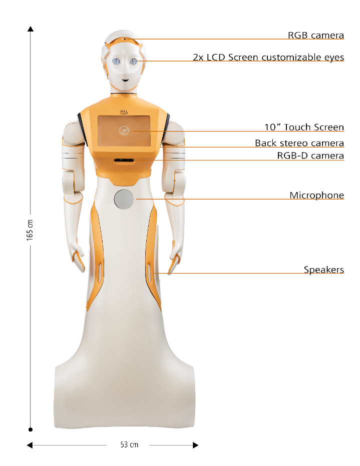
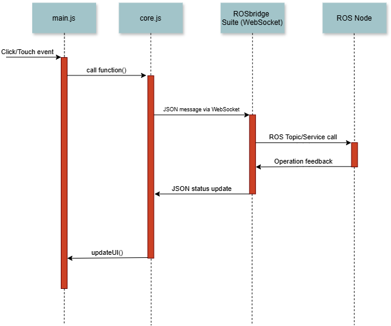
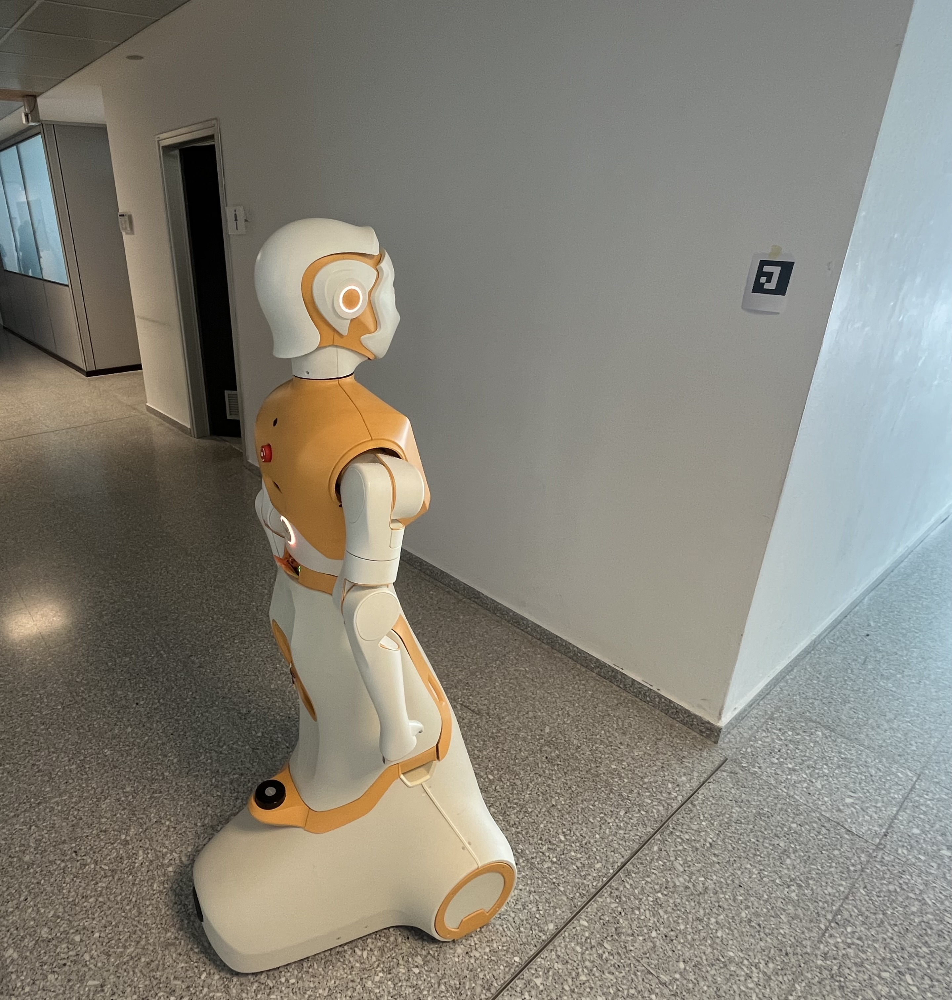
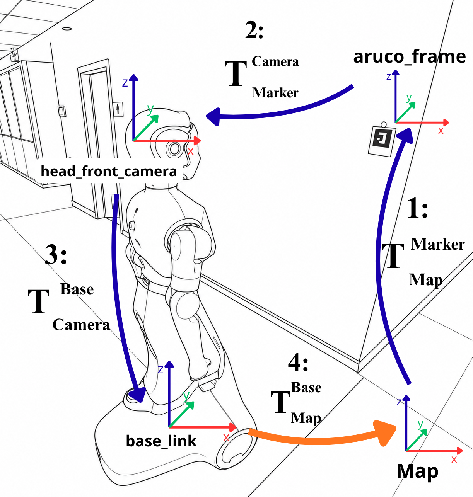
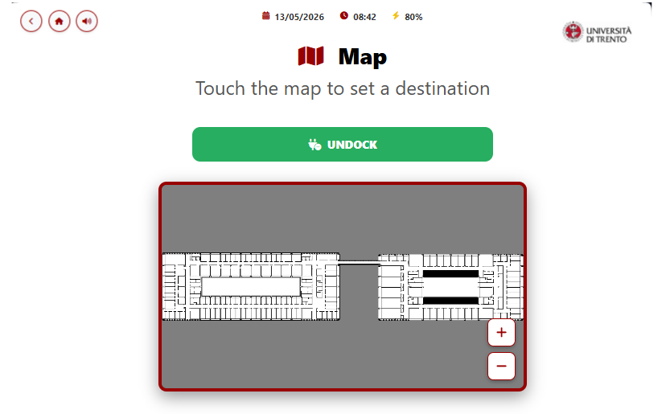

# A Robot Secretary for University Environments: Developing the Navigation and Interaction System for the ARI Robot

This project explores the development and deployment of the PAL Robotics ARI robot within the University of Trento. Specifically, it features a custom user interface designed to control and monitor the robot's functionalities, a series of personalized human-robot interactions, and a dedicated navigation system tailored for orienting and moving autonomously within the university environment.

<p align="center">
    
</p>

---

## Contents
- [Repository Structure](#repository-structure)
- [System Architecture](#system-architecture)
- [Main Components](#main-components)
  - [ROS Backend](#ros-backend)
  - [UI Frontend](#ui-frontend)
- [System Requirements](#system-requirements)
- [Docker Deployment](#docker-deployment)

---

## Repository Structure

The repository is organized into two main components: the frontend interface and the ROS backend scripts. The frontend directory is subdivided into modular folders, each containing an HTML file for the page layout and a JavaScript file that manages screen interactions, telemetry, and dynamically loads configurations.

```text
├── README.md
├── display                     # Frontend web interface components
│   ├── README.md
│   ├── back_cam
│   ├── cam_menu
│   ├── degree_presentation
│   ├── front_cam
│   ├── front_fisheye_cam
│   ├── interactions
│   ├── map
│   ├── menu
│   ├── navigation_menu
│   ├── news
│   ├── poi
│   ├── python_scripts          # Script to fetch and update current news into the configuration files
│   ├── rear_fisheye_cam
│   ├── room_presentation
│   ├── speech
│   ├── start_screen
│   ├── tools                   # Shared assets, styles, and core modules
│   │   ├── assets
│   │   ├── js
│   │   │   ├── core.js         # Core script handling global configuration and rosbridge communication
│   │   │   └── lib             # External JavaScript libraries
│   │   └── style
│   │       └── style.css
│   ├── torso_cam
│   └── torso_front_cam_infra
└── scripts                     # ROS Backend (Python nodes and launch files)
    ├── README.md
    ├── ArUco_data.py
    ├── aruco_logger.py
    ├── calibration.py
    ├── camera_data.py
    ├── custom_nodes.launch
    └── path_planner.py
```
---

## System Architecture

The architecture coordinates user interactions on the frontend interface with corresponding backend responses using the `rosbridge_suite` WebSocket protocol. This bridge enables real-time exchange of JSON-formatted messages between the UI and the ROS ecosystem. 

The core logic of this communication is isolated within `display/tools/core.js`. This module implements an abstraction layer, exposing reusable functions to the rest of the frontend application while concealing low-level WebSocket management, which significantly enhances code readability and maintainability. 

Through this layer, the frontend transmits messages both to the custom ROS nodes developed specifically for this project (such as the navigation modules) and directly to ARI's native ROS nodes to trigger built-in functionalities (like Text-to-Speech).

<p align="center">
  
</p>

To provide a highly customized user experience during human-robot interactions, the system integrates a Large Language Model (LLM). The LLM is guided by a specific system prompt that defines ARI's role as a secretary, details its operational environment, and supplies a dedicated knowledge base to answer a wide variety of user inquiries accurately. 

The interaction pipeline follows a precise sequence:
1. **Speech-to-Text (STT):** The system captures the user's vocal input and converts it into a text transcript.
2. **LLM Processing:** The text transcript is appended to the contextual system prompt and transmitted to the LLM.
3. **Text-to-Speech (TTS):** Once the LLM generates a response, the system triggers ARI's vocal capabilities to read the final message back to the user.

---

## Main Components

This section details the inner workings of the system, breaking down the specific responsibilities of the ROS backend and the web frontend.

### ROS Backend

The backend architecture leverages custom ROS nodes designed to address localization challenges and manage path planning:

*   **Calibration Node (`calibration.py`):** Long, featureless corridors and accumulated odometry drift can cause ARI to lose its localized position on the map. To resolve this, a custom calibration node handles map relocalization. It detects ArUco markers using image streams from ARI's head and torso RGB-D cameras. Once a marker is identified by its ID, its absolute map coordinates are retrieved from a configuration file. The node then computes a chain transformation via transformation matrices ($T$), correcting ARI's position estimation in real time.
*   **Path Planning Node (`path_planner.py`):** Because ARI cannot constantly look at ArUco markers during continuous navigation, this script calculates a strategic path. Given a starting position and a final destination, it identifies which ArUco markers are located along the route. The system then sequences intermediate waypoints, commanding ARI to stop at these checkpoints to perform calibration and prevent localization failure.

<p align="center">
   
  
</p>

### UI Frontend

The frontend is a modular web interface composed of HTML views, each paired with a dedicated JavaScript controller (`main.js`) that manages page-specific logic and UI interactions. The user experience flows through a main menu providing access to four primary functional areas:

*   **Navigation:** Allows users to command the robot to move. It offers two modalities: an interactive, clickable 2D map for selecting custom coordinates, and a list of predefined Points of Interest (POIs) linked to specific university locations.
*   **Interactions:** Manages human-robot interaction through two main channels: physical gestures (triggering pre-programmed animations while standing still) and speech options. Speech includes both static, predefined sentences and an advanced, interactive LLM mode powered by the customized system prompt mentioned in the architecture section.
*   **Cameras:** Displays a dashboard containing accessible camera feeds on ARI, allowing users to switch views and monitor real-time video streams from different onboard sensors.
*   **News:** Formats and presents the latest university announcements, parsed dynamically from configuration files updated by backend scripts.

<table align="center" border="0" cellpadding="0" cellspacing="0">
  <tr>
    <td align="center" valign="middle" style="border: none;">
      
    </td>
    <td align="center" valign="middle" style="border: none; padding-left: 20px;">
      
    </td>
  </tr>
</table>

## System Requirements


## Docker Deployment