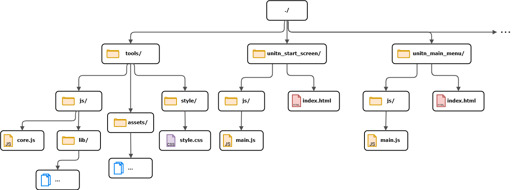
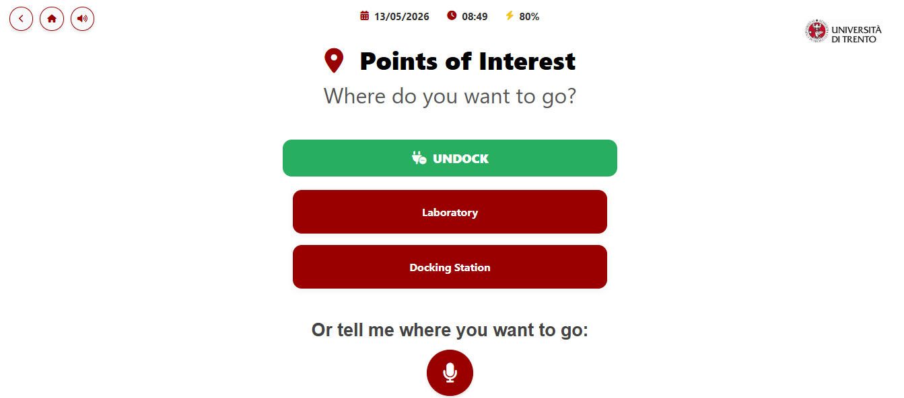
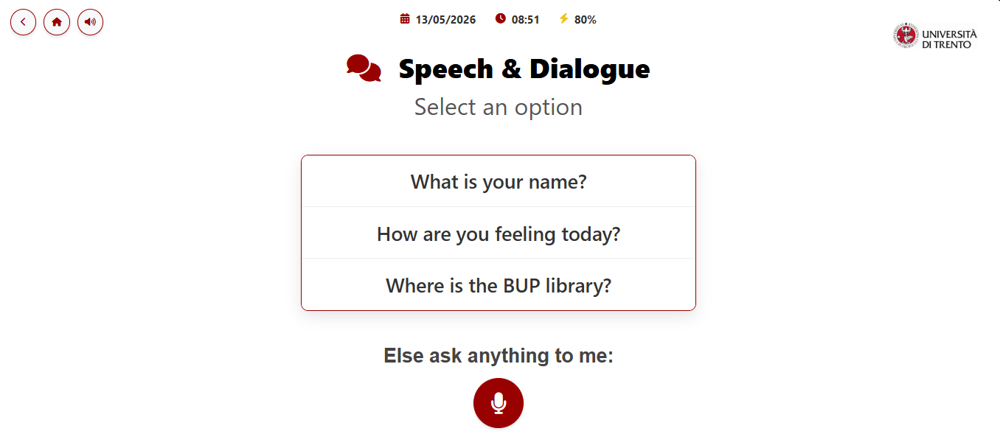

# User Interface Frontend

This section of the repository contains the implementation of ARI's web interface. The project is organized into a modular tree structure of directories, strictly adhering to PAL Robotics' conventions for ARI's onboard touchscreen interface.

<p align="center">
  
</p>

---

## Page Architecture

Every functional view follows a standardized layout composed of an `index.html` file and a `js/` directory housing a `main.js` controller. 
*   **`index.html`:** Defines the structural layout and markup of the specific page.
*   **`js/main.js`:** Contains the JavaScript logic governing interface navigation, event handling, and page-specific features.

### The `tools/` Directory
The only exception to this pattern is the `tools/` directory, which serves as the shared backbone of the frontend application:
*   **`style.css`:** Centralizes the CSS classes and design tokens used across the entire interface.
*   **`assets/configuration.json`:** Decouples dynamic data (such as room numbers or news) from the core source code, making the interface easily configurable.
*   **`js/core.js`:** The critical core of the frontend. It abstracts the communication between the UI and the ROS backend via `rosbridge_suite`. It manages all topic subscriptions and publications, while dynamically loading the global layout from the configuration files.

---

## Directory Structure

To maintain readability, standard `index.html` and `js/main.js` files are omitted from the folder tree below:

```text
├── README.md
├── back_cam
├── cam_menu
├── degree_presentation
├── front_cam
├── front_fisheye_cam
├── interactions
├── map
├── menu
├── navigation_menu
├── news
│   └── news_detail.html            # Dedicated view for displaying full news articles
├── poi
├── python_scripts
│   └── update_news.py              # Utility to fetch remote updates and cache them locally in the configuration
├── rear_fisheye_cam
├── room_presentation
├── speech
├── start_screen
├── tools
│   ├── assets
│   │   └── configuration.json      # Centralized project configurations and environmental data
│   ├── js
│   │   ├── core.js                 # Core ROS-Web abstraction layer
│   │   └── lib                     # Third-party JavaScript libraries
│   └── style
│       └── style.css               # Global application stylesheet
├── torso_cam
└── torso_front_cam_infra
```

---

## List of Pages

The user application initiates with a **Start Screen** which, upon a touch interaction, redirects to the **Main Menu**. The core dashboard is organized as follows:

*   **Navigation Menu:** Presents the available modalities to command the robot's movement. It links to two distinct views:
    *   **Map Page:** Renders an interactive, clickable 2D map allowing users to select exact target coordinates.
    *   **POI Page:** Displays a structured list of predefined Points of Interest (POIs) across the university. This view also features a "microphone" action that captures the user's vocal input, extracts the desired destination, and initiates autonomous navigation once the user confirms their selection.
*   **Interactions Menu:** Offers a collection of immediate robotic behaviors, such as pre-programmed physical gestures. It also acts as the gateway to two specialized interaction subsystems:
    *   **Speech Page:** Features a set of quick-access, static statements ARI can vocalize, alongside an interactive "microphone" action. Activating the microphone triggers the complete interaction pipeline: Speech-to-Text conversion, contextual system-prompt enrichment, LLM query processing, and final Text-to-Speech output. Crucially, ARI synchronizes real-time physical gestures with its vocalization to ensure a more fluid, lifelike, and natural conversation.
    *   **Presentation Pages:** Dedicated multimedia layouts that display specific video content while ARI delivers an oral presentation, fully utilizing synchronized speech and co-verbal gestures.
*   **Cameras Menu:** Aggregates a multi-camera dashboard displaying live image streams from ARI's integrated vision sensors to demonstrate their distinct field-of-view capabilities.
*   **News List:** A dynamic notice board displaying the latest events and official announcements from the University of Trento.

<p align="center">
  
  
</p>