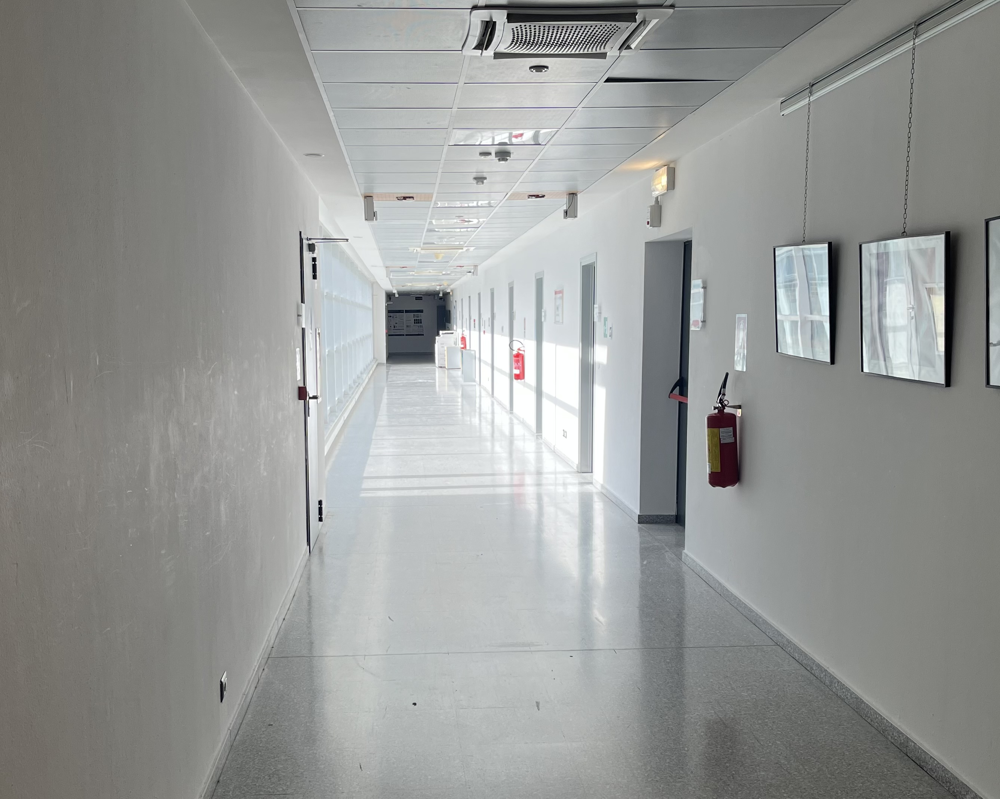
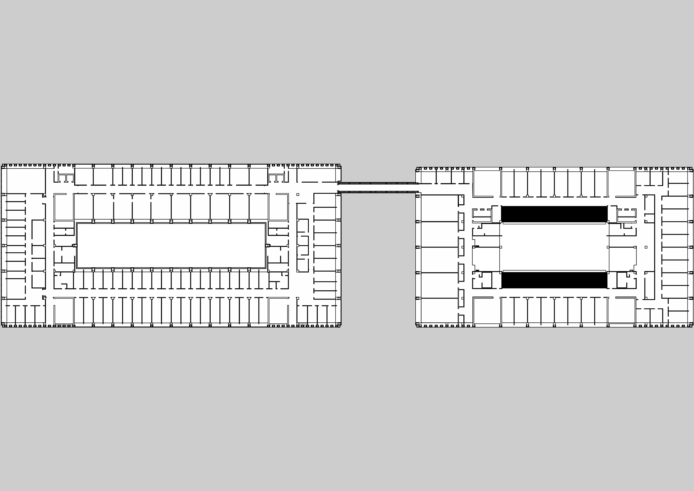

# ROS Backend

This directory contains the custom ROS nodes, utility scripts, and spatial configuration files that drive the robot's backend architecture. All scripts are developed in Python 3 and leverage core robotics and computer vision libraries.

## Folder Structure

```text
├── ArUco_data.py           # Database containing map coordinates and IDs of all deployed ArUco markers
├── README.md
├── aruco_logger.py         # Utility script to log and print ArUco marker positions relative to the map
├── calibration.py          # Relocalization node that computes position corrections via visual ArUco tracking
├── camera_data.py          # Intrinsic parameters of ARI's cameras for precise matrix transformations
├── custom_nodes.launch     # Launch file configured for ARI's startup system deployment
├── map_parameters          # Environmental mapping assets
│   ├── map.yaml            # Metadata configuration specifying origin, resolution, and thresholds
│   ├── mmap.yaml
│   └── submap_0.pgm        # Occupational grid map in PGM format
└── path_planner.py         # Custom waypoint sequencer that routes ARI through calibration checkpoints
```

---

## The Problem & Solution

The target environment at the University of Trento (Povo) presents unique challenges for autonomous navigation: it consists of long, featureless corridors. Standard LiDAR-based SLAM (Simultaneous Localization and Mapping) approaches often degrade in these environments due to geometric symmetry, as different locations look identical to laser scanners. This symmetry prevents robust scan matching and leads to severe mapping artifacts.

To mitigate this, a high-precision CAD-derived map was integrated into the system (`map_parameters/submap_0.pgm`). This layout was referenced within the ROS navigation stack via `map_parameters/map.yaml` by calibrating parameters such as the **origin** (the coordinate offset of the map's bottom-left corner relative to the world frame) and **resolution** (meters per pixel).

However, a precise static map alone does not fully resolve localization drift. As ARI navigates down long corridors, wheel slippage and accumulated odometry errors continually degrade position estimation without LiDAR features to correct them. To address this issue, a dual-node system was developed:
1. **A Calibration Node:** Dynamically relocalizes the robot whenever an ArUco marker is spotted.
2. **A Path Planning Node:** Intercepts standard trajectories to schedule mandatory stops at ArUco checkpoints along the path.

<table align="center" border="0" cellpadding="0" cellspacing="0">
  <tr>
    <td align="center" valign="middle" style="border: none;">
      
    </td>
    <td align="center" valign="middle" style="border: none; padding-left: 20px;">
      
    </td>
  </tr>
</table>

---

## Script Functionalities

While `calibration.py` and `path_planner.py` run continuously as active nodes on the robot, `aruco_logger.py` was used exclusively during the setup phase to register marker positions.

### 1. `calibration.py`
This node executes visual relocalization. When an ArUco marker enters the field of view of ARI's head or torso RGB-D cameras, the node identifies its ID, fetches its ground-truth coordinates from `ArUco_data.py`, and computes the robot's true map position. This is achieved through a kinematic transformation chain aiming to isolate the transform matrix $T_{map}^{base}$. 

The mathematical sequence is executed as follows:
*   The matrix $T_{map}^{marker}$ is loaded from the database, defining the marker's absolute pose on the map.
*   The camera estimates the relative transformation to the marker ($T_{camera}^{marker}$), which is subsequently inverted to yield $T_{marker}^{camera}$.
*   The robot's native TF (Transform) tree provides the rigid transform between the base link and the optical frame ($T_{base}^{camera}$), which is inverted to obtain $T_{camera}^{base}$.
*   The final map-to-base coordinate matrix is computed via matrix multiplication:
    $$T_{map}^{base} = T_{map}^{marker} \times T_{marker}^{camera} \times T_{camera}^{base}$$
*   The resulting pose is published directly to the appropriate localization topic, overriding the drifted odometry estimation.

### 2. `path_planner.py`
This script implements an interleaved path-planning routine designed to maintain localization tracking over long distances by introducing mandatory calibration stops:
*   The node receives a global destination coordinate from the frontend interface.
*   The current localized starting pose is sampled from the system.
*   The native ROS navigation stack generates a standard global path.
*   The script samples the path trajectory and calculates the Euclidean distance between the planned path points and known ArUco marker locations. If a marker falls below a specific proximity threshold (e.g., 2 meters), it is marked as a candidate checkpoint.
*   Checkpoints are collected, filtered, and sorted in reverse order (ordered from the start position toward the destination).
*   The node executes sequential navigation commands to each checkpoint. Upon reaching a checkpoint, the robot halts for 2 seconds to guarantee stable camera frames for the `calibration.py` node before continuing toward the final target.

### 3. `aruco_logger.py`
A development utility that outputs the current coordinates of detected ArUco markers relative to the map frame. To map these coordinates accurately during the provisioning phase, the robot was first manually relocalized using PAL Robotics' WebGUI localization tools to establish a reliable baseline before running the logger.

<p align="center">
   &nbsp;&nbsp;&nbsp;&nbsp;
  
</p>

---

## Deployment on ARI's Production System

Following local validation, the core scripts were deployed onto ARI's onboard computer to run as persistent background daemons initiated at system boot.

The integration strictly follows the official [PAL Robotics Application Deployment Guide](https://docs.pal-robotics.com/ari/sdk/23.1.12/management/startup-apps.html). The architecture is isolated within a dedicated workspace directory located at `/home/pal/deployed_ws`. This specific path is scanned natively by ARI's startup manager to load custom user environments. Autonomous execution and node lifecycle management are orchestrated via the custom `custom_nodes.launch` file, which registers the custom Python scripts into the global ROS master environment.

---

## Core Dependencies

The backend architecture relies on the following key libraries and ROS action servers to manage vision, spatial transformations, and autonomous movement:

| Library / Module | Functional Purpose | Context within the Project |
|---|---|---|
| **`rospy`** | Core ROS client library for Python. | Registers scripts as active nodes, manages logging, and handles pub/sub topics. |
| **`actionlib`** | Manages asynchronous goal-oriented tasks. | Allows the path planner to send destinations, monitor navigation states, and abort safely. |
| **`cv2` & `cv2.aruco`** | OpenCV Computer Vision library. | Processes raw camera frames to detect pixels, decode IDs, and estimate ArUco poses. |
| **`numpy` (np)** | Advanced numerical and matrix calculus. | Manages the linear algebra operations for cross-multiplying and inverting transformation matrices. |
| **`tf2_ros` / `tf`** | ROS transform tree lookup ecosystem. | Tracks the geometric relationships between ARI’s mobile base, cameras, and the global map. |
| **`tf.transformations`** | Handles complex 3D orientation math. | Converts human-readable Euler angles into the 4D Quaternions required by the ROS navigation stack. |
| **`MoveBaseAction`** | Standard ROS navigation controller interfaces. | Packages coordinates into action goals to drive the standard autonomous navigation engine. |
| **`GoToFloorPOIAction`** | PAL Robotics composite navigation server. | Handles high-level autonomous navigation directly targeting specific Points of Interest (POIs). |